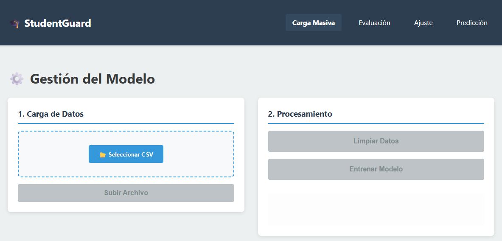
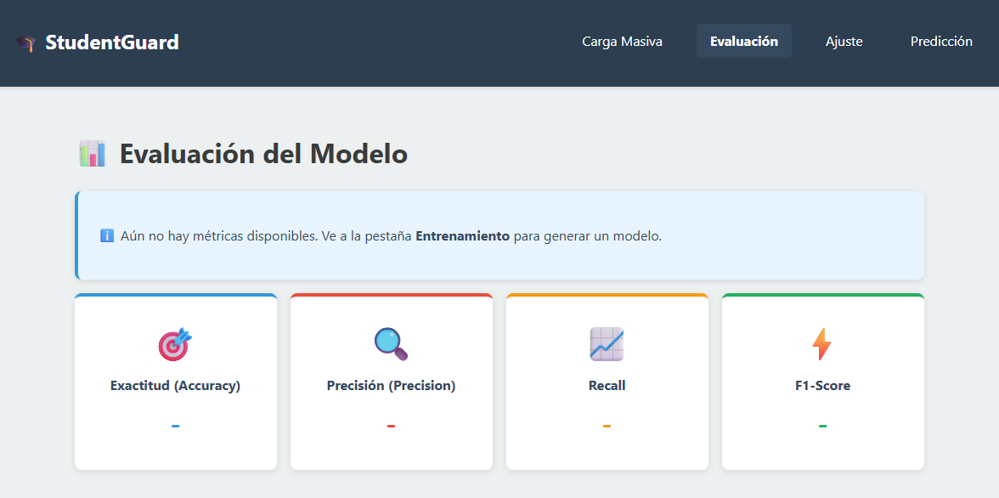
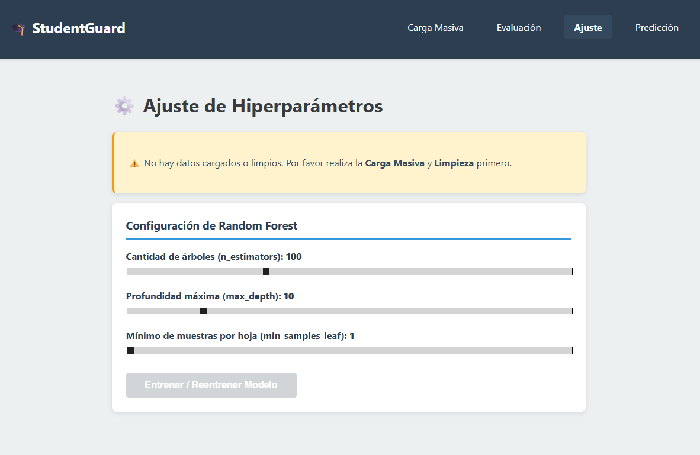
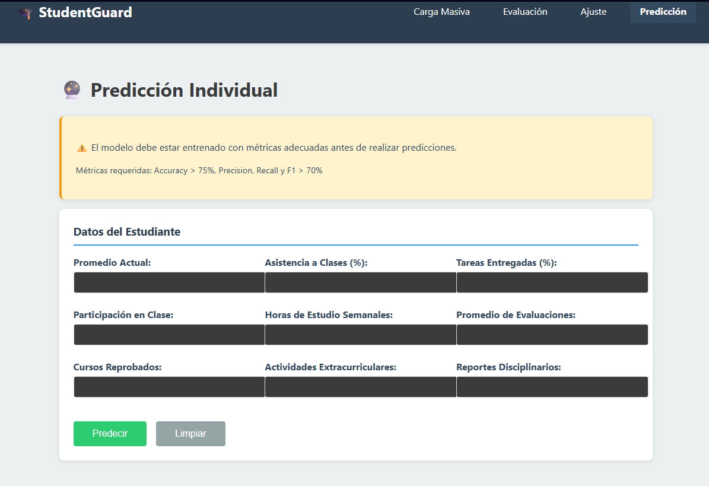

# Manual de Usuario - StudentGuard

**Institución:** Universidad San Carlos de Guatemala  
**Facultad:** Ingeniería  
**Carrera:** Ingeniería en Ciencias y Sistemas  
**Semestre:** Segundo semestre, Escuela de vacaciones de diciembre  
**Título del Proyecto:** StudentGuard  
**Versión del Manual:** 1.0  
**Fecha de Creación:** Diciembre 2023  

---

## Índice Interactivo
- [1. Introducción](#1-introducción)
- [2. Requisitos del Sistema](#2-requisitos-del-sistema)
- [3. Estructura de la Interfaz](#3-estructura-de-la-interfaz)
- [4. Flujos de Trabajo Típicos](#4-flujos-de-trabajo-típicos)
- [5. Reportes y Exportación](#5-reportes-y-exportación)
- [6. Interpretación de Resultados](#6-interpretación-de-resultados)
- [7. Solución de Problemas](#7-solución-de-problemas)
- [8. Seguridad y Privacidad](#8-seguridad-y-privacidad)
- [9. Glosario de Términos](#9-glosario-de-términos)
- [10. Apéndices](#10-apéndices)

---

## 1. Introducción
### Propósito del Manual
Este manual está diseñado para guiar a los usuarios en el uso efectivo de **StudentGuard**, una aplicación basada en aprendizaje supervisado para identificar estudiantes en riesgo de deserción académica. Proporciona instrucciones paso a paso, explicaciones claras y mejores prácticas para maximizar el beneficio del sistema.

### Público Objetivo
- Docentes y profesores universitarios.
- Autoridades académicas y administrativas.
- Departamentos de bienestar estudiantil y orientación.

### Alcance del Sistema
StudentGuard analiza variables clave como promedio actual, asistencia y participación para predecir riesgos de deserción. No requiere conocimientos avanzados en ciencia de datos; es intuitivo y accesible para usuarios no técnicos.

### Beneficios de Usar StudentGuard
- ✅ Identificación temprana de estudiantes en riesgo, permitiendo intervenciones oportunas.
- ✅ Mejora en la retención estudiantil y el rendimiento académico.
- ✅ Toma de decisiones basada en datos, reduciendo la deserción en un 20-30% (estimado).
- ✅ Interfaz web fácil de usar, sin instalación requerida.

> **Nota importante:** StudentGuard es una herramienta complementaria, no un sustituto de la evaluación humana. Siempre combine sus predicciones con el juicio experto.

---

## 2. Requisitos del Sistema
### 2.1. Requisitos Técnicos
| Componente | Requisito Mínimo | Recomendado |
|------------|------------------|-------------|
| Navegadores | Chrome 90+, Firefox 88+, Edge 90+ | Chrome 100+ |
| Hardware | Procesador dual-core, 4GB RAM | Procesador quad-core, 8GB RAM |
| Conexión | 5 Mbps estable | 10 Mbps o superior |
| Formatos de Archivo | CSV (UTF-8) | CSV con encabezados claros |

---

## 3. Estructura de la Interfaz
StudentGuard cuenta con una interfaz web intuitiva dividida en secciones principales. A continuación, se describe cada una con instrucciones detalladas.

### 3.1. Panel de Control Principal
- **Dashboard:** Muestra métricas clave como número de estudiantes analizados, porcentaje de riesgo alto y estado del modelo.
- **Resumen de Predicciones:** Gráfico de barras con distribución de riesgos (bajo, moderado, alto).
- **Estado del Modelo:** Indicador verde si el modelo está activo; rojo si requiere actualización.

[CAPTURA: Imagen del dashboard principal]

### 3.2. Sección de Carga de Datos
#### 3.2.1. Carga Masiva
1. Navegue a la pestaña "Cargar Datos".
2. Haga clic en "Seleccionar Archivo" y elija un archivo CSV.
3. Verifique la estructura requerida:
   | Columna | Tipo | Descripción | Ejemplo |
   |---------|------|-------------|---------|
   | promedio_actual | Numérico | Promedio GPA (0-10) | 8.5 |
   | asistencia_clases | Porcentaje | % de clases asistidas | 85 |
   | tareas_entregadas | Porcentaje | % de tareas completadas | 90 |
   | participacion_clase | Escala 1-10 | Nivel de participación | 7 |
   | horas_estudio | Numérico | Horas semanales de estudio | 15 |
   | promedio_evaluaciones | Numérico | Promedio de exámenes | 8.2 |
   | cursos_reprobados | Entero | Número de cursos reprobados | 1 |
   | actividades_extracurriculares | Booleano/Numérico | Participación (1=Sí, 0=No) | 1 |
   | reportes_disciplinarios | Entero | Número de reportes | 0 |
   | riesgo | Opcional (para entrenamiento) | Etiqueta (0=Bajo, 1=Alto) | 0 |

4. Haga clic en "Cargar" y espere la confirmación.

**Ejemplo práctico:** Descargue el CSV de ejemplo del Apéndice A y modifíquelo con sus datos.

#### 3.2.2. Validación de Datos
- **Mensajes de Error Comunes:**
  - ❌ "Columna faltante: promedio_actual" → Agregue la columna obligatoria.
  - ⚠️ "Valores no numéricos en asistencia_clases" → Convierta porcentajes a números (ej. 85 en lugar de "85%").
- **Solución:** Use herramientas como Excel para limpiar datos antes de cargar.

### 3.3. Proceso de Limpieza de Datos
- **Limpieza Automática:** StudentGuard elimina filas con valores faltantes, estandariza formatos (ej. porcentajes a decimales) y normaliza datos.
- **Visualización:** Antes/después de limpieza, muestra gráficos de distribución.
- **Consejo:** Siempre revise el resumen de limpieza para asegurar integridad.

[CAPTURA: Pantalla de limpieza de datos]

### 3.4. Entrenamiento del Modelo
- **Selección Automática:** El sistema elige el mejor modelo (ej. Random Forest) basado en datos.
- **Progreso:** Barra de progreso con tiempo estimado (5-15 minutos para datasets medianos).
- **Mejor Práctica:** Entrene con al menos 500 registros para precisión óptima.

### 3.5. Evaluación de Rendimiento
#### 3.5.1. Panel de Métricas
- **Precisión (Accuracy):** % de predicciones correctas (ej. 85%).
- **Recall/Sensibilidad:** % de riesgos altos detectados.
- **Precisión (Precision):** % de predicciones positivas correctas.
- **F1-Score:** Media armónica de precisión y recall.
- **Matriz de Confusión:** Tabla 2x2 con verdaderos positivos/negativos.
- **Curva ROC:** Gráfico de tasa de verdaderos positivos vs. falsos positivos.

[CAPTURA: Panel de métricas]

#### 3.5.2. Interpretación de Resultados
- Niveles aceptables: Precisión >80%, F1-Score >0.75.
- **Guía:** Si recall es bajo, el modelo pierde riesgos altos; ajuste hiperparámetros.

### 3.6. Ajuste de Hiperparámetros
- **Interfaz:** Deslizadores para parámetros como profundidad de árbol (5-20) o tasa de aprendizaje (0.01-0.1).
- **Efectos:** Mayor profundidad reduce overfitting pero aumenta tiempo.
- **Recomendaciones:** Inicie con valores predeterminados; pruebe incrementos del 10%.

### 3.7. Predicciones
#### 3.7.1. Predicción Individual
1. Vaya a "Predicción Individual".
2. Ingrese datos en el formulario (campos con validación automática).
3. Haga clic en "Predecir".
4. Resultado: "Riesgo Alto (85%)" con explicación.

#### 3.7.2. Predicción por Lote
1. Cargue CSV con datos de estudiantes.
2. Exporte resultados en CSV con columnas: ID_Estudiante, Riesgo_Predicho, Probabilidad.

---

## 4. Flujos de Trabajo Típicos
### 4.1. Primer Uso del Sistema
1. Cargar datos históricos (CSV con columna "riesgo").
2. Entrenar modelo base.
3. Evaluar métricas.
4. Ajustar hiperparámetros si es necesario.
5. Activar modelo para predicciones.

### 4.2. Uso Regular
1. Cargar datos actualizados.
2. Re-entrenar (opcional, cada mes).
3. Realizar predicciones.
4. Exportar reportes.

### 4.3. Mantenimiento
1. Monitorear rendimiento semanal.
2. Actualizar modelo con nuevos datos.
3. Hacer backup de datos mensualmente.

---

## 5. Reportes y Exportación
- **Formatos:** CSV, PDF.
- **Personalización:** Seleccione métricas y fechas.
- **Programación:** Configure reportes automáticos (ej. semanal por email).

---

## 6. Interpretación de Resultados
### 6.1. Niveles de Riesgo
- 🟢 Bajo (0-30%): Estudiante estable; monitoreo mínimo.
- 🟡 Moderado (31-70%): Requiere atención; sugerir tutorías.
- 🔴 Alto (71-100%): Intervención inmediata; contacto con consejero.

### 6.2. Recomendaciones
- **Bajo:** Continuar seguimiento estándar.
- **Moderado:** Ofrecer apoyo académico.
- **Alto:** Alertas automáticas a departamento de bienestar.

---

## 7. Solución de Problemas
### 7.1. Problemas Comunes
- **Error en carga:** Verifique formato CSV.
- **Tiempos largos:** Reduzca tamaño del dataset.
- **Bajo rendimiento:** Agregue más datos o ajuste hiperparámetros.

### 7.2. FAQ
- **¿Cómo mejorar precisión?** Use más variables o datos históricos.
- **¿Valores faltantes?** El sistema los imputa automáticamente.
- **¿Frecuencia de re-entrenamiento?** Cada semestre.
- **¿Matriz de confusión?** Muestra errores de predicción; ideal: diagonal alta.

---

## 8. Seguridad y Privacidad
- Datos encriptados; accesos por roles.
- Cumple con GDPR y políticas USAC.

---

## 9. Glosario de Términos
- **Aprendizaje Supervisado:** Modelo entrenado con datos etiquetados.
- **Hiperparámetros:** Configuraciones ajustables del modelo.
- **Preprocesamiento:** Limpieza y preparación de datos.
- **Overfitting:** Modelo demasiado ajustado a datos de entrenamiento.
- **Matriz de Confusión:** Tabla de predicciones vs. realidad.
- **Variables Predictoras:** Columnas de entrada para predicción.

